# dust_free_encoder
This is a remix for the popular encoder used by the ercf V1 and V2. It mainly focuses on keeping the encoder compartment isolated so that filament dust will less settle inside the encoder wheel and binky sensor.

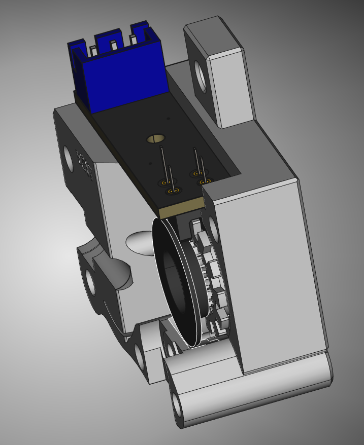

## Remix
The added dust protection ring has been printed in SEBS for my tests but should be printable with TPU or maybe even PETG.
Space has been made in the left and right sides of the encoder to accomodate for this new element.

The `Steps` folder contains the following:

| File | Description | illustration |
| --- | --- | --- |
| encoder_right_housing_remixed_for_ercfv1_623.step | The right encoder part remixed to accomodate the insulation ring and also have the magnet holder for the ercfv1 magnetic gates when running 623 bearings. | 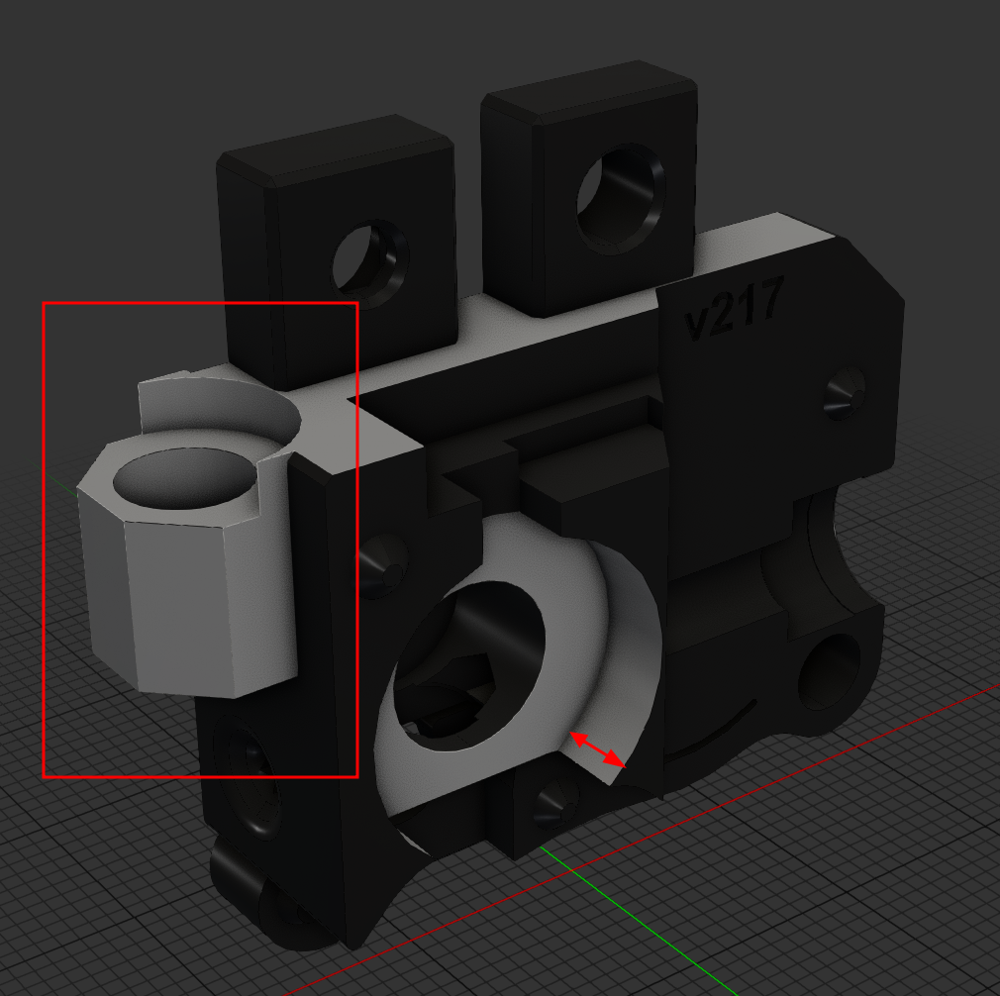 |
| encoder_right_housing_remixed_for_ercfv2_623.step | The right encoder part remixed to accomodate the insulation ring when running 623 bearings.  | 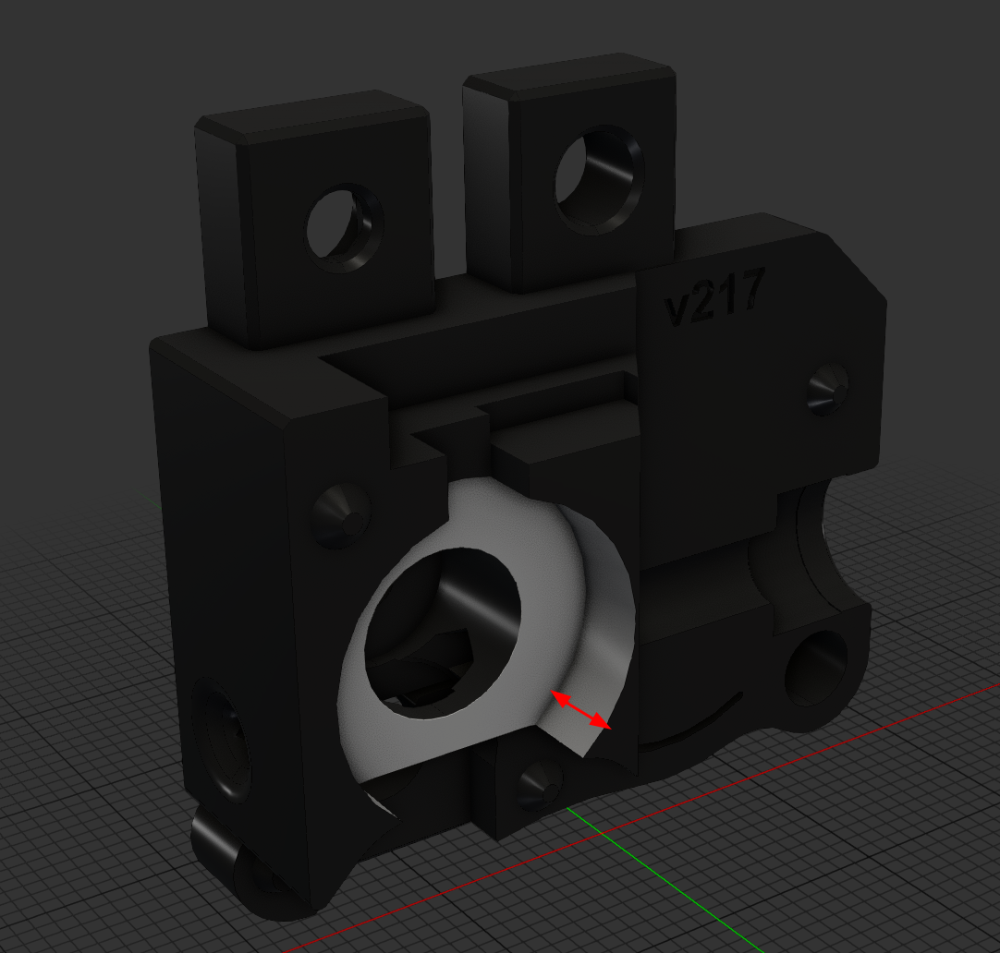 |
| encoder_right_housing_remixed_for_ercfv2_V.step | The right encoder part remixed to accomodate the insulation ring when running V bearings.  | 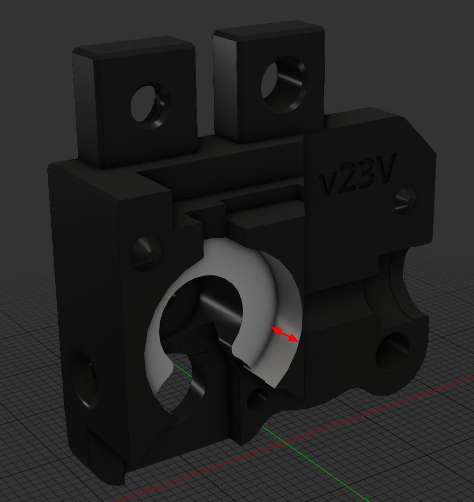 |
| encoder_left_housing_remixed_623.step | The left encoder part remixed to accomodate the insulation ring when running 623 bearings. | 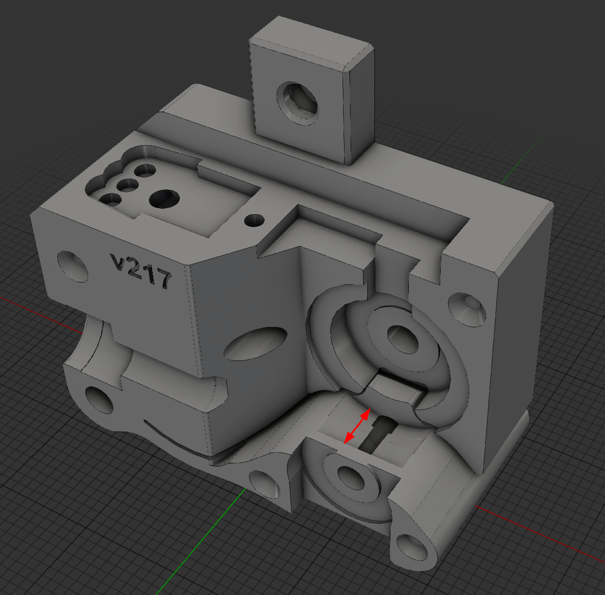 |
| encoder_left_housing_remixed_V.step | The left encoder part remixed to accomodate the insulation ring when running V bearings. | 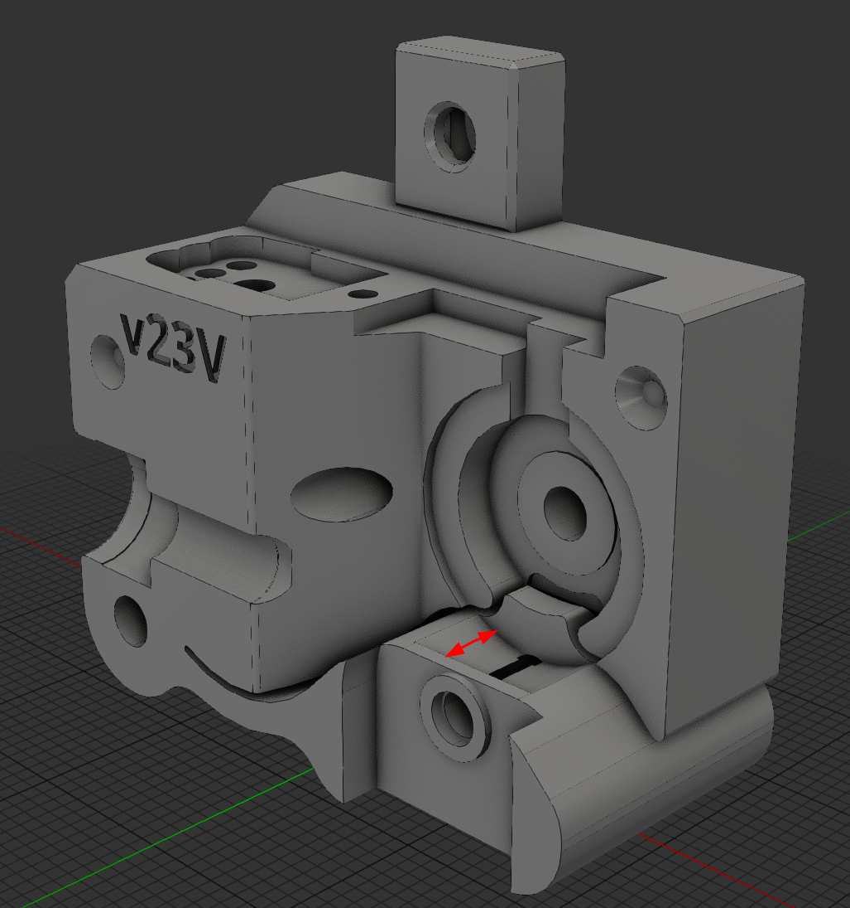 |
| dust_insulation_ring.step | The insulation ring that will be placed between the encoder wheel and the encoder housing. | 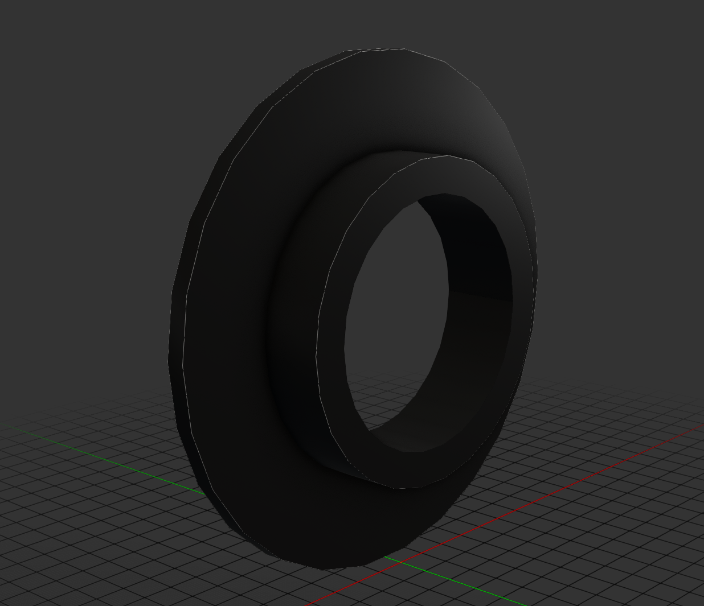 |

The `Steps/EREC` Folder contains the following:
| File | Description | illustration |
| --- | --- | --- |
| encoder_right_housing_remixed_for_erec_623.step | The right encoder part remixed to accomodate the insulation ring when running 623 bearings.  | 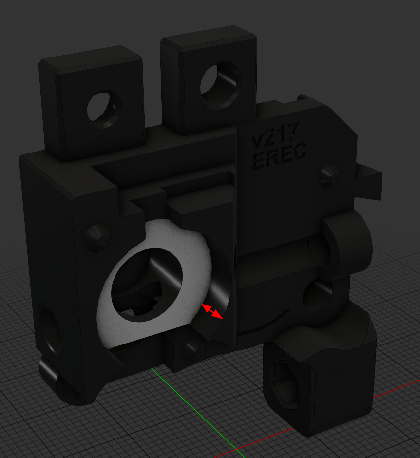 |
| encoder_right_housing_remixed_for_erec_V.step | The right encoder part remixed to accomodate the insulation ring when running V bearings.  | 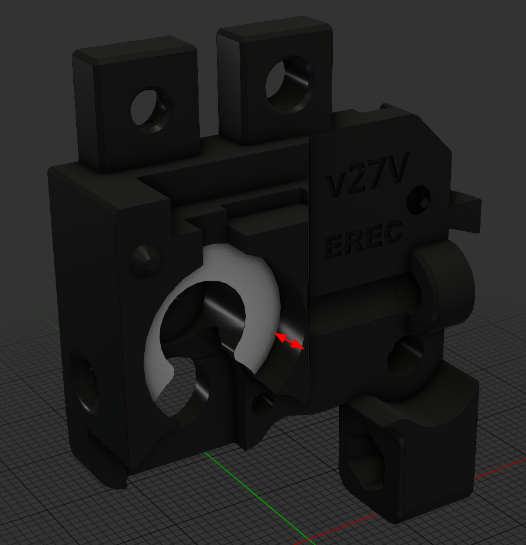 |
| encoder_left_housing_remixed_for_erec_623.step | The left encoder part remixed to accomodate the insulation ring when running 623 bearings.  | 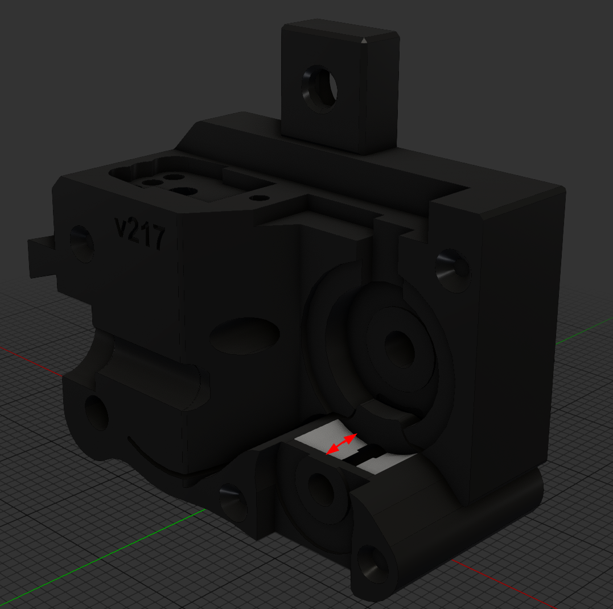 |
| encoder_left_housing_remixed_for_erec_V.step | The left encoder part remixed to accomodate the insulation ring when running V bearings.  | 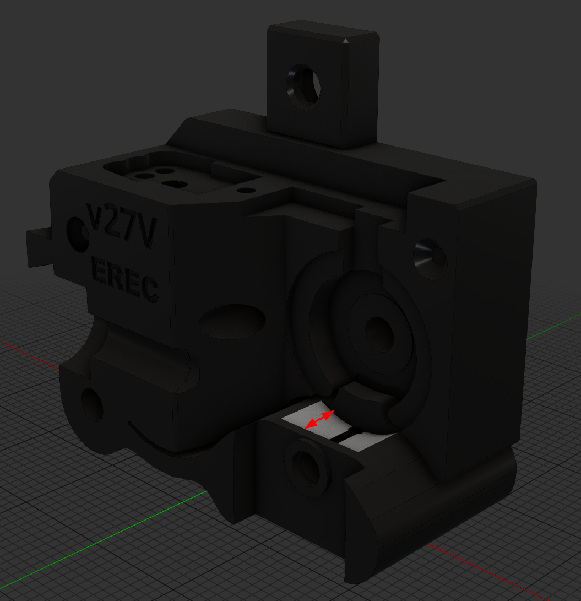 |

# Note
The only missing configuration would be the `encoder_right_housing_remixed_for_ercfv1_V.step` which might be added upon request. EREC does not need to differentiate between V1 and V2 as it doesn't support magnetic gates.
