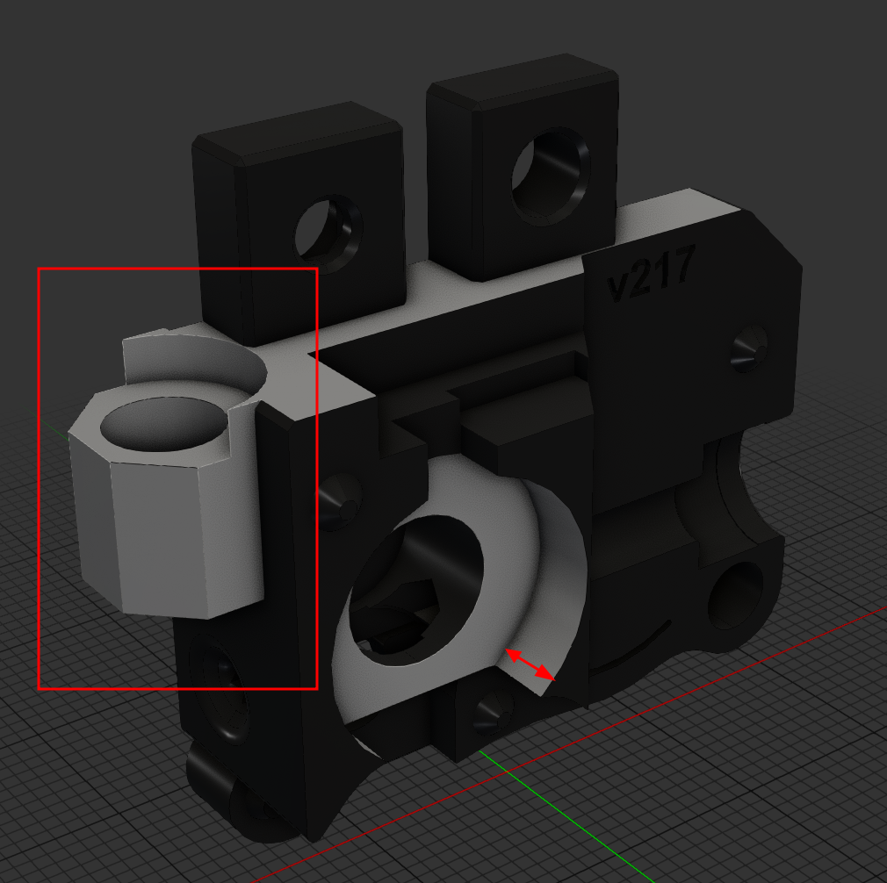
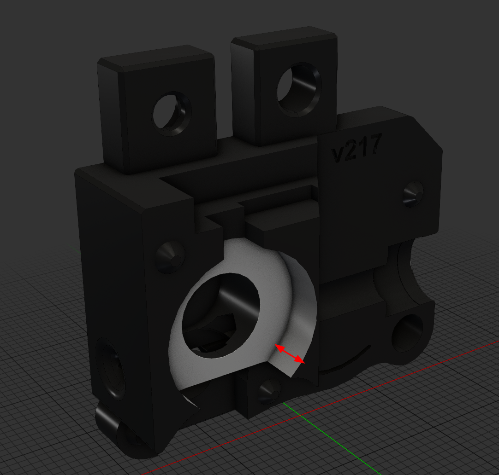
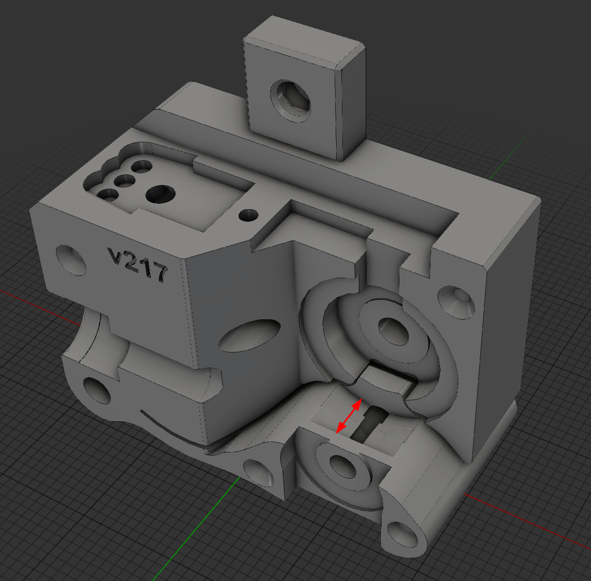

# dust_free_encoder
This is a remix for the popular encoder used by the ercf V1 and V2. It mainly focuses on keeping the encoder compartment isolated so that filament dust will less settle inside the encoder wheel and binky sensor.

## Remix
The added dust protection ring has been printed in SEBS for my tests but should be printable with TPU or maybe even PETG.
Space has been made in the left and right sides of the encoder to accomodate for this new element.

The `Steps` folder contains the following:

| File | Description | illustration |
| --- | --- | --- |
| `encoder_right_housing_remixed_for_ercfv1.step` | The right encoder part remixed to accomodate the insulation ring and also have the magnet holder for the ercfv1 magnetic gates.  |  |
| `encoder_right_housing_remixed_for_ercfv2.step` | The right encoder part remixed to accomodate the insulation ring.  |  |
| `encoder_left_housing_remixed.step` | The left encoder part remixed to accomodate the insulation ring. |  |
| `dust_insulation_ring.step` | The insulation ring that will be placed between the encoder wheel and the encoder housing. |  |

# Note
Only the version for v623 bearing is available for now, the V bearing option might be added later on inn regards to this mods popularity.
